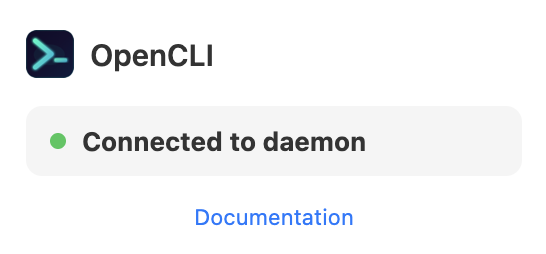

# Openfeed

OpenFeed is an LLM-powered personal recommendation system that finds
cross-platform internet content tailored to your interests and learns from your
feedback over time.

You describe the topics you care about. OpenFeed finds sources on YouTube, X,
TikTok, and the web; filters new content against your taste; pushes the
surviving cards to your feed; and learns from feedback over time.

## Quickstart

These steps help OpenFeed learn your initial preferences from TikTok and build
a local content feed for you. When setup is complete, you can view and interact
with the feed at `http://localhost:8765`.

The Quickstart pushes to the built-in localhost web feed. It uses TikTok as the
source platform, so you need Google Chrome, the Browser Bridge extension, and a
logged-in TikTok session.

### 1. Set up and install

Run these commands from the directory where you want your keys and OpenFeed's runtime
files to live. Keep the code checkout separate from those runtime files:

```bash
git clone https://github.com/darthjaja6/Openfeed.git openfeed

./openfeed/scripts/install
source .venv/bin/activate

cp openfeed/examples/web/openfeed.yaml openfeed.yaml
cp openfeed/examples/web/.env.local.example .env.local
cp openfeed/examples/web/run-openfeed run-openfeed
chmod +x run-openfeed
mkdir -p output
```

### 2. Connect Chrome to TikTok

Install opencli:

```bash
npm install -g @jackwener/opencli
```

Install the Browser Bridge Chrome extension:

1. Download the latest `opencli-extension-v{version}.zip` from
   <https://github.com/jackwener/opencli/releases>.
2. Unzip it.
3. Open `chrome://extensions` in Google Chrome.
4. Enable **Developer mode**.
5. Click **Load unpacked** and select the unzipped extension folder.

Then open Google Chrome, log in to TikTok, and run:

```bash
opencli doctor
```

When the Browser Bridge is connected, the OpenCLI extension should show:



### 3. Configure OpenFeed

Open `openfeed.yaml` and replace the example topic and description with
something you want to watch. You can tune the rest later.

Then add your OpenRouter API key to `.env.local`:

```bash
OPENROUTER_API_KEY=sk-or-v1-...
```

### 4. Start OpenFeed

Start the local scheduler and feed server:

```bash
./run-openfeed start
```

`start` runs `openfeed doctor` first. If config, credentials, templates, or
local tools are missing, it stops and tells you what to fix. After that it runs
the supply, prepare, and refill loops, then opens the local feed at
`http://127.0.0.1:8765/`. The first cards can take a while because OpenFeed
needs to find sources, review content, and build the queue.

## Next Steps

### Change What OpenFeed Finds

Edit `openfeed.yaml` to change your topic, description, language preferences,
or enabled platforms. The next `./run-openfeed start` run reads the updated
config and reconciles topic state before collecting new content.

### Run in the Background

`./run-openfeed start` is the foreground runner. After the Quickstart works, use
cron on a machine that should keep OpenFeed running:

```cron
*/15 * * * * /path/to/my-openfeed/run-openfeed supply
* * * * * /path/to/my-openfeed/run-openfeed prepare
* * * * * /path/to/my-openfeed/run-openfeed refill
0 3 * * 1 /path/to/my-openfeed/run-openfeed discover
```

### Push to Ticlawk

The Quickstart uses `examples/web` and shows cards on localhost. To push to
Ticlawk instead, start from `examples/ticlawk`, set your Ticlawk publisher key
in `.env.local`, and replace the example channel id in `openfeed.yaml`. Ticlawk
is useful when you want the feed in a hosted app instead of only on your local
machine. Run `./run-openfeed smoke` from that example before starting the full
producer; it publishes one minimal HTML card to verify the Ticlawk API key and
per-topic `consumer_config.channel_id` without using OpenRouter, OpenCLI,
Browser Bridge, source discovery, or media preparation. The same consumer
contract is described in
[Custom feed clients](docs/custom-producer.md).

## Advanced

- [Production operations](docs/operations.md)
- [Internal runtime defaults](docs/runtime-config.md)
- [Custom feed clients](docs/custom-producer.md)
- [Architecture](docs/architecture.md)

## Contributing

The regression suite runs in GitHub Actions on pull requests and pushes to
`main`. Run the same check locally before submitting a change:

```bash
uv run python skills/openfeed-e2e/run_e2e.py
```

See `CONTRIBUTING.md` for the full contribution guide.

## License

Apache License 2.0. See `LICENSE`.
